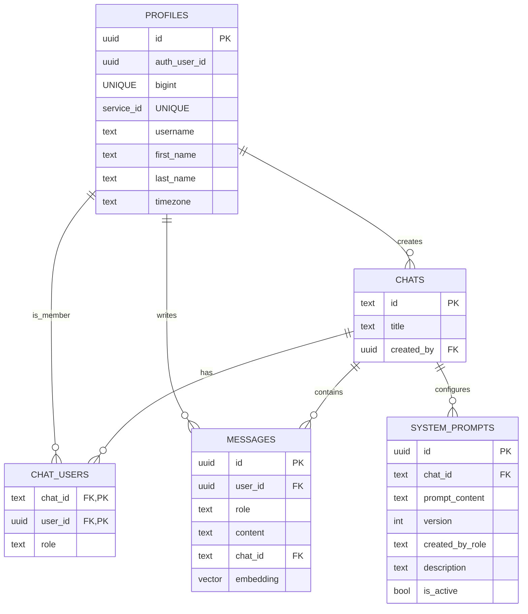
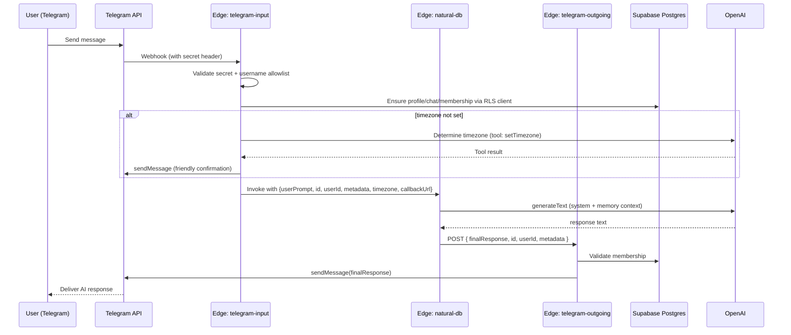
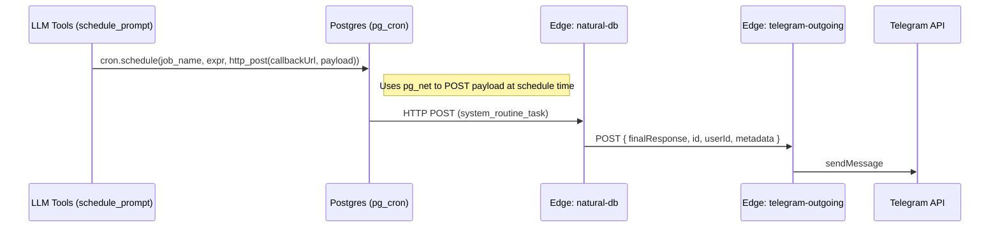

## Natural-DB — Architecture, Developer, and PM Guide

This document provides a comprehensive overview of the Natural-DB system from three complementary perspectives: software architecture, software development, and product management. It explains how the Telegram-facing assistant, database memory model, scheduling, and AI tooling work together, and how to extend or operate the system safely.

---

## System at a Glance

- **Interface**: Telegram bot (`telegram-input` webhook in Supabase Edge Functions)
- **Core Brain**: `natural-db` Edge Function (OpenAI + tools + memory)
- **Delivery**: `telegram-outgoing` Edge Function (authorization + formatting + Telegram API)
- **Platform**: Supabase (Postgres, RLS, Edge Runtime, Storage, Analytics)
- **Intelligence**: OpenAI via Vercel AI SDK (`npm:ai`) + embeddings (`text-embedding-3-small`)
- **Autonomy**: Scheduling via `pg_cron` and HTTP callbacks via `pg_net`
- **Long-term Memory**: `public.messages` (+ `pgvector`) and LLM-owned `memories` schema

### High-level Topology

```mermaid
graph TD
    User[User on Telegram] -->|Message/Webhook| TI[Edge Function: telegram-input]
    TI -->|Invoke| ND[Edge Function: natural-db]
    ND -->|Callback JSON| TO[Edge Function: telegram-outgoing]
    TO -->|sendMessage| Telegram[Telegram Bot API]

    ND-.->|SQL (service_role for system ops)| Postgres[(Supabase Postgres)]
    ND-.->|SQL (memories_role for restricted ops)| MemoriesSchema[(Schema: memories)]
    ND-.->|Embeddings & GenAI| OpenAI[(OpenAI APIs)]
    Postgres -. pg_cron .-> ND
    Postgres -. pg_net .-> ND
```

---

## Core Components

### Edge Functions

- **`supabase/functions/telegram-input/index.ts`**
  - Webhook receiver; validates Telegram secret (`X-Telegram-Bot-Api-Secret-Token`).
  - Enforces user allowlist via `ALLOWED_USERNAMES`.
  - Creates/updates `public.profiles` rows, ensures `public.chats` and `public.chat_users` membership.
  - Initiates anonymous auth for a per-request RLS-bound client.
  - Optionally sets timezone via an AI tool when missing, then asynchronously invokes `natural-db`.

- **`supabase/functions/natural-db/index.ts`**
  - Central “brain”: constructs AI calls, manages tools, and orchestrates memory.
  - Validates incoming payload via Zod, generates final response using OpenAI model.
  - Calls `telegram-outgoing` with the final response.
  - Uses helpers in `db-utils.ts` for secure SQL execution paths and memory utilities.

- **`supabase/functions/telegram-outgoing/index.ts`**
  - Final authorization (allowlist + chat membership) and message delivery to Telegram API.
  - Accepts `{ finalResponse, id, userId, metadata }` payloads.

### Shared Utilities

- **`supabase/functions/natural-db/db-utils.ts`**
  - Provides two execution lanes:
    - `executeRestrictedSQL` → runs as `memories_role` within `memories` schema with guards.
    - `executePrivilegedSQL` → system-level ops in `public/cron/extensions` (service role).
  - Message utilities: load recent chat history, search similar messages via `pgvector`, insert messages, generate embeddings via OpenAI.

- **`supabase/functions/natural-db/tools.ts`**
  - Tool surface exposed to the AI runtime (via Vercel AI SDK `tool`):
    - `execute_sql`: run DDL/DML in `memories` schema.
    - `get_distinct_column_values`: convenience SELECT DISTINCT helper.
    - `schedule_prompt` / `unschedule_prompt`: cron orchestration via `pg_cron` + `pg_net`.
    - `update_system_prompt` / `get_system_prompt_history`: manage personalization history.

### Database Schema and Security

- Migration: `supabase/migrations/20250623120000_create_initial_schema.sql`
  - `public.profiles`, `public.chats`, `public.chat_users`, `public.messages`, `public.system_prompts`.
  - RLS policies ensure users access only their data through RLS-bound clients.
  - Extensions: `vector` (pgvector), `pg_cron`, `pg_net`.
  - `memories` schema + `memories_role` with scoped privileges and resource guards.



---

## End-to-End Flows

### 1) Telegram Message Processing



### 2) Scheduled Prompts (Autonomous Routines)



---

## Memory Model

- **Short-term (Chronological)**: Recent `public.messages` by chat, loaded in order to preserve context.
- **Long-term (Semantic)**: `pgvector` similarity search against `public.messages.embedding` to retrieve relevant historical context.
- **Structured (LLM-owned)**: LLM creates and manages tables in `memories` schema using tools like `execute_sql` to persist arbitrary facts, lists, and records.

---

## Security Posture

- **RLS by Default**: `profiles`, `chats`, `chat_users`, `messages` enforce per-user access through RLS-bound clients.
- **Scoped Role for LLM**: `memories_role` confines LLM-created objects to `memories` schema and adds resource guards (`statement_timeout`, etc.).
- **Edge Function Boundaries**: `telegram-input` and `telegram-outgoing` use service role for admin checks, while user data access routes through RLS clients.
- **Allowlist & Webhook Validation**: `ALLOWED_USERNAMES` and `TELEGRAM_WEBHOOK_SECRET` mitigate unsolicited requests.
- **Dependency Stability**: Version-pinned npm imports in Edge Runtime prevent runtime incompatibility issues.

---

## Multi-Tenancy Architecture

- One organization equals one tenant. Each `chat` belongs to exactly one tenant, and tenant isolation is enforced across all tenant-scoped tables.
- Core tenant tables: `public.tenants` and `public.tenant_memberships` map `auth.users(id)` to a `tenant_id` with a role (`owner`, `admin`, `member`).
- Add `tenant_id` to tenant-scoped tables and backfill in phases:
  - Existing: `public.profiles`, `public.chats`, `public.messages`.
  - LLM-owned: selected `memories.*` tables (e.g., `memories.fees`, `memories.fee_jobs`, `memories.documents`, `memories.notification_settings`, `memories.fee_calendar_events`).

### Stable tenant resolver (transaction-pool safe)

Use a stable function that reads the tenant from the JWT claim or request header (avoid per-session GUCs under pooling):

```sql
create or replace function auth.current_tenant_id() returns uuid
language sql stable as $$
  select coalesce(
    nullif(current_setting('request.jwt.claims', true), '')::jsonb ->> 'tenant_id',
    current_setting('request.header.x-tenant-id', true)
  )::uuid
$$;
```

### RLS policy template (apply to all tenant tables)

```sql
alter table profiles enable row level security;
create policy tenant_isolation on profiles
  using (tenant_id = auth.current_tenant_id());

alter table chats enable row level security;
create policy tenant_isolation on chats
  using (tenant_id = auth.current_tenant_id());

alter table messages enable row level security;
create policy tenant_isolation on messages
  using (tenant_id = auth.current_tenant_id());

-- Repeat analogous policies for all memories.* tables you tenant-scope
```

### JWT and headers wiring

- Prefer embedding `tenant_id` in the JWT at login; fallback to sending `x-tenant-id` from Edge Functions or clients on every request.
- Example client configuration:

```ts
const supabase = createClient(url, anonKey, {
  global: { headers: { 'x-tenant-id': tenantId } }
});
```

### Pipeline and scheduling propagation

- Persist `tenant_id` on `chats`; include it in all orchestrator payloads and scheduled messages.
- For `pg_cron`/`pg_net` jobs, include `tenant_id` in the job payload or ensure the invoked Edge Function sets `x-tenant-id` on DB calls.

### Constraints, rollout, and observability

- Add FKs (e.g., `chats.tenant_id → tenants.id`) and unique constraints scoped by tenant where needed.
- Rollout safely in phases: add nullable column → backfill → add indexes → enable RLS → add policies → flip to `NOT NULL` when ready.
- Log `tenant_id` in structured logs; ensure service-role code still propagates tenant context (`x-tenant-id` or JWT with `tenant_id`).

---

## Configuration & Environment

- Deno project config: `deno.json`
  - Imports map for `@ai-sdk/openai`, `ai`, `zod`, `@supabase/supabase-js`, and `postgres`.
  - Handy tasks: `dev` (`supabase start`), `deploy` (`supabase functions deploy --no-verify-jwt`), `serve`.

- Required environment variables (Edge):
  - `SUPABASE_URL`, `SUPABASE_SERVICE_ROLE_KEY`, `SUPABASE_ANON_KEY`
  - `TELEGRAM_BOT_TOKEN`, `TELEGRAM_WEBHOOK_SECRET`, `ALLOWED_USERNAMES` (CSV)
  - `OPENAI_API_KEY`, optional `OPENAI_MODEL`
  - For DB utils: `SUPABASE_DB_URL` (Postgres connection pool)

---

## Developer Guide

- **Local Dev**
  - Install Supabase CLI and run: `deno task dev` → starts local stack.
  - Push migrations: `supabase db push`.
  - Serve functions locally: `deno task serve`.

- **Deploy**
  - Ensure env vars are set in Supabase Project → Edge Functions.
  - Deploy: `deno task deploy` (`--no-verify-jwt` configured for public webhooks).

- **Key Module Responsibilities**
  - `telegram-input`: request validation, identity bootstrap, timezone onboarding, invoke brain.
  - `natural-db`: reasoning + tool use + memory I/O + callback.
  - `telegram-outgoing`: authorization recheck + send Telegram message.
  - `db-utils`: safe SQL execution lanes, embeddings, history, semantic recall.
  - `tools`: tool contracts exposed to the LLM.

- **Error Handling Patterns**
  - Guard early; return meaningful 4xx for validation errors and 5xx for server issues.
  - In `natural-db`, on failure attempt to inform the end-user via callback with a friendly message.

---

## Product View

- **Value Proposition**
  - Memory-enabled AI that persists facts, schedules actions, and integrates with messaging where users live (Telegram). Low operational cost and scalable via serverless.

- **Key Use Cases**
  - Personal tracking (runs, meals), periodic reports (weekly summaries), article collection and reminders, lightweight CRM/feedback analysis, and more (extend via tools/Zapier MCP).

- **Reliability & Cost**
  - Edge Functions autoscale; primary external dependency is OpenAI quota/rate limits.
  - Storage and vector search in Postgres keeps costs predictable; small per-message OpenAI token cost.

- **Success Metrics**
  - Response success rate, p95 latency, scheduled job completion rate, user retention, content engagement (e.g., link clicks / replies).

---

## Extensibility Roadmap

- **Additional Interfaces**: Web UI, SMS, Slack/Discord adapters; reuse the same `natural-db` API contract.
- **New Tools**: Integrations via MCP (Gmail, Calendar, Notion, Slack). Add as `tools.ts` exports.
- **Enhanced Memory**: Task/goal graphs in `memories` schema; summarization pipelines to reduce token load.
- **Observability**: Structured logs, tracing (OpenTelemetry), function-level dashboards and alerts.

---

## Operational Notes

- Prefer version-pinned npm imports for Edge Runtime stability.
- Keep RLS policies tight; verify every data path uses the correct client (RLS vs service role).
- For `pg_cron` jobs, ensure payloads contain `incomingMessageRole: system_routine_task` and correct callback URL.
- Ensure `ALLOWED_USERNAMES` is set during early testing to avoid unsolicited traffic.

---

## Appendix: API Contracts (Simplified)

- `telegram-input` webhook (Telegram Update subset):
  - Validates secret header; extracts `message.text`, `from`, `chat.id`.
  - On timezone missing: uses a tool to set profile timezone and replies immediately.
  - Otherwise invokes `natural-db` with:
    - `{ userPrompt, id: chatId, userId: profileId, metadata: { platform, serviceId, username, chatId }, timezone, incomingMessageRole: "user", callbackUrl }`

- `natural-db` request schema (Zod):
  - `{ userPrompt: string, id: string|number, userId: string, metadata?: Record<string, unknown>, timezone?: string|null, incomingMessageRole: "user"|"assistant"|"system"|"system_routine_task", callbackUrl: string }`
  - Responds 200 with `{ status: "ai_processing_complete_for_id" }` after posting to callback.

- `telegram-outgoing` payload:
  - `{ finalResponse: string, id: string|number, userId: string, metadata: { username?: string, chatId: string|number } }`
  - Re-checks allowlist and chat membership; then calls Telegram `sendMessage`.

---

## Selected References

- `supabase/functions/telegram-input/index.ts`
- `supabase/functions/natural-db/index.ts`
- `supabase/functions/natural-db/tools.ts`
- `supabase/functions/natural-db/db-utils.ts`
- `supabase/functions/telegram-outgoing/index.ts`
- `supabase/migrations/20250623120000_create_initial_schema.sql`
- `deno.json`


