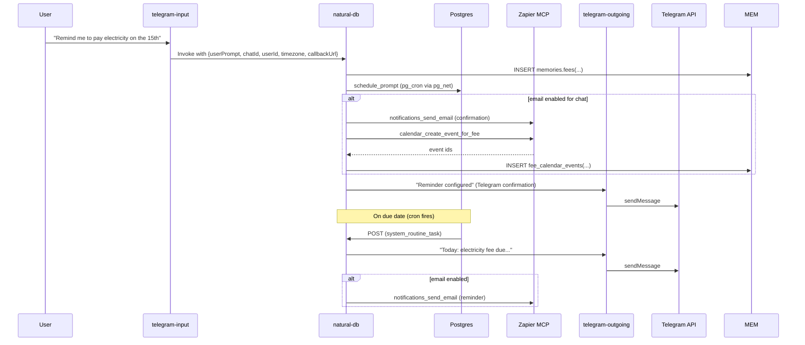
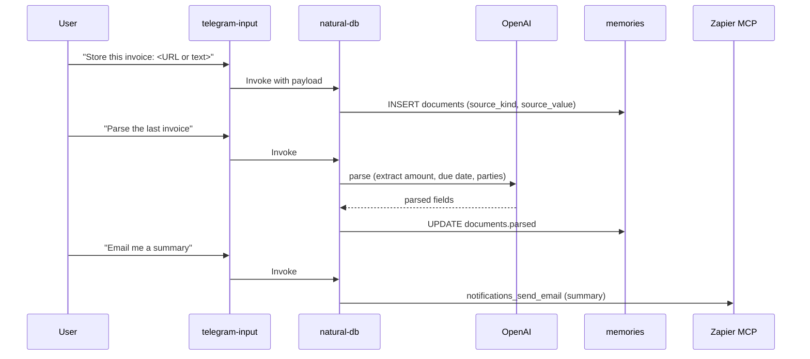

## PRD: Real Estate Agency CS Bot (MVP) with Zapier MCP Email & Calendar

### Summary
- Build a Telegram-based customer service bot specialized for real estate agencies.
- MVP focuses on:
  - Scheduling: recurring fee reminders (electricity, management, water, other).
  - Documents: contract/invoice ingestion (as text/URL), parsing, and retrieval.
  - Email & Calendar: Zapier MCP to send email notifications and create calendar events.

### Goals
- Enable tenants/agents to set monthly reminders for recurring fees with timezone-aware delivery.
- Store and parse basic documents to extract key fields for later Q&A.
- Send email notifications and create recurring calendar events for due dates via Zapier MCP.
- Keep implementation minimal by reusing current `natural-db` tools, scheduling, and Telegram pipeline.

### Non-Goals
- File attachments (Telegram document uploads, OCR/PDF parsing).
- Complex recurrence (bi-monthly, exceptions).
- Payment processing or invoice generation.
- Multi-agent orchestration beyond single-model tool usage.

### Success Metrics
- >95% successful monthly reminder delivery (Telegram + email when enabled).
- <3s p95 end-to-end response time for interactive commands.
- >90% successful email sends and calendar event creations when enabled.
- <2% tool/integration error rate.

## Users & Use Cases
- Tenant: “Remind me to pay electricity on the 15th every month,” “What’s on my invoice?”
- Agent: “List all management fee reminders for this chat,” “Email me a summary of last contract.”
- Admin (future): Manage org-wide defaults and dashboards.

## Requirements

### Functional
- Fee reminders:
  - Create/list/cancel monthly reminders per chat with fee type, due day, optional amount/currency/note.
  - On creation: schedule a cron job; if email is enabled, send confirmation email and create calendar event.
  - On due date: send Telegram reminder; if email is enabled, also send email reminder.
- Documents:
  - Store document as text or URL.
  - Parse documents via OpenAI into a minimal schema; support Q&A against parsed fields.
  - Email a parsed summary on request.
- Email/Calendar:
  - Store per-chat notification settings (email, enable flag, provider, default reminder minutes).
  - Use Zapier MCP for send email and create/cancel calendar events.
- Security:
  - Maintain existing allowlist and RLS posture.
  - Keep PII minimal (email only in `memories.notification_settings`).

### Non-Functional
- Stable imports (version-pinned), robust error handling with user-facing fallbacks.
- Minimal database load; index core lookups.
- Observability: structured logs with high-level outcomes.

## System Architecture

### High-level
```mermaid
graph TD
    U[User (Telegram)] --> TI[Edge: telegram-input]
    TI --> ND[Edge: natural-db]
    ND --> TO[Edge: telegram-outgoing]
    TO --> TG[Telegram API]

    ND-.->|service ops| DB[(Supabase Postgres)]
    ND-.->|memories_role| MEM[(Schema: memories)]
    ND-.->|OpenAI| AI[(OpenAI APIs)]
    ND-.->|Zapier MCP| ZMCP[(Zapier MCP Server)]

    DB -. pg_cron .-> ND
    DB -. pg_net .-> ND
```

### Fee creation and notifications


### Documents: store, parse, and email summary


## Data Model Changes (memories schema)
- `memories.fees`
  - id UUID PK; chat_id TEXT; fee_type TEXT CHECK IN ('electricity','management','water','other'); amount NUMERIC NULL; currency TEXT NULL; due_day SMALLINT CHECK 1–31; note TEXT NULL; is_active BOOLEAN DEFAULT true; created_at/updated_at.
- `memories.fee_jobs`
  - id UUID PK; fee_id UUID FK; cron_job_name TEXT UNIQUE; cron_expression TEXT; timezone TEXT NULL; created_at.
- `memories.documents`
  - id UUID PK; chat_id TEXT; doc_type TEXT CHECK IN ('contract','invoice','other'); source_kind TEXT CHECK IN ('text','url'); source_value TEXT; parsed JSONB NULL; created_at.
- `memories.notification_settings`
  - chat_id TEXT PK; email TEXT NOT NULL; email_enabled BOOLEAN DEFAULT true; calendar_provider TEXT DEFAULT 'google'; default_reminder_minutes INT DEFAULT 60; created_at/updated_at.
- `memories.fee_calendar_events`
  - id UUID PK; fee_id UUID FK; external_event_id TEXT NOT NULL; external_calendar_id TEXT NULL; provider TEXT DEFAULT 'google'; created_at.

Note: CRUD via `execute_sql` tool under `memories_role`.

## Tooling (extensions in `supabase/functions/natural-db/tools.ts`)
- fees_create({ fee_type, due_day, amount?, currency?, note? })
  - Insert fee; compute monthly cron; call `schedule_prompt` with prompt “Send a fee reminder for fee_id=X and chat_id=Y”; persist to `fee_jobs`.
  - If email enabled: send confirmation email and create calendar event; store `fee_calendar_events`.
- fees_list_active()
  - List active fees for chat.
- fees_cancel({ fee_id })
  - Set inactive; `unschedule_prompt` by job_name; clean up `fee_calendar_events`.
- docs_store({ doc_type, source_kind, source_value })
  - Insert document row.
- docs_parse({ document_id })
  - Call OpenAI to extract minimal fields; update `parsed`.
- notifications_set_email_prefs({ email, email_enabled?, calendar_provider?, default_reminder_minutes? })
  - Upsert into `notification_settings`.
- notifications_send_email({ to?, subject, html?, text? })
  - Resolve recipient from prefs if `to` absent; use Zapier MCP email action.
- calendar_create_event_for_fee({ fee_id, title? })
  - Create recurring calendar event via Zapier MCP; store mapping.
- calendar_cancel_event_for_fee({ fee_id })
  - Delete/cancel event via Zapier MCP; remove mapping.
- docs_email_summary({ document_id, to? })
  - Email a concise summary of parsed fields and source.

Zapier MCP bootstrap in `natural-db/index.ts` if `ZAPIER_MCP_URL` set using `experimental_createMCPClient`.

## User Prompts (Examples)
- “Set my email to john@example.com and enable email reminders.”
- “Remind me to pay water on the 10th each month for 30 USD.”
- “List my fee reminders.”
- “Cancel the management fee reminder.”
- “Store this invoice: https://…”
- “Parse the last invoice.”
- “Email me a summary of the last contract.”
- “Create a calendar event for my electricity fee reminder.”

## Error Handling
- Invalid email → prompt to re-enter.
- MCP unavailable/failure → proceed with Telegram-only, inform user that email/calendar was skipped.
- Conflicting fee schedules → allow duplicates and include notes, or ask for disambiguation.

## Privacy & Security
- Store only email and prefs in `memories.notification_settings`.
- Keep existing allowlist and RLS.
- Do not store Zapier tokens; MCP handles auth.

## Rollout Plan
- Day 1–2: Migrations + tools scaffolding (fees_*, docs_*).
- Day 3–4: Orchestrator wiring (intent mapping, scheduled reminder handling).
- Day 5: Document parsing via OpenAI; docs email summary.
- Day 6: Integrate Zapier MCP for email/calendar; tests and copy.
- Buffer: Hardening and doc updates.

## Acceptance Criteria
- Create fee → fee row, job scheduled; Telegram confirms; if email enabled, email sent and calendar event created.
- Cron fires → Telegram reminder sent; if email enabled, email reminder sent.
- List fees → returns active reminders for chat.
- Cancel fee → unscheduled; event canceled; Telegram confirms; optional email confirmation.
- Store/parse doc → rows persisted; parsed JSONB has basic fields; bot can answer field queries.
- Email summary → email arrives with parsed values and link/text.

## Observability
- Log tool invocations and outcomes (success/failure codes).
- Monitor error rate of MCP calls; alert on spikes.
- Capture p95 latency per Edge Function and per tool.

## Risks & Mitigations
- Timezone handling: store tz per chat; cron time computed in UTC; document limitations.
- MCP variability: graceful fallback to Telegram-only; clear UX copy.
- Parsing inconsistencies: keep schema minimal; store raw text for re-parse.

## Open Questions
- Should duplicate fee reminders be merged or allowed? (Default: allow; user can cancel specific ones.)
- Do we need per-fee custom reminder time? (MVP: 09:00 local; configurable later.)
- Do we need multi-user email per chat? (MVP: single email per chat.)

## Implementation Notes (Codebase Fit)
- Reuse existing:
  - `schedule_prompt`, `unschedule_prompt`, `execute_sql` tool patterns.
  - Telegram pipeline (`telegram-input` → `natural-db` → `telegram-outgoing`).
  - Embeddings/utilities in `db-utils.ts`.
- Add:
  - New memory tables (migrations).
  - New tools in `tools.ts`.
  - MCP bootstrap in `natural-db/index.ts` and tool wrappers.
  - Light intent routing and system_routine_task handler for “fee reminder” formatting.

- Env:
  - `ZAPIER_MCP_URL` required for email/calendar.
  - `OPENAI_API_KEY`, `SUPABASE_*`, `TELEGRAM_*` already in use.

- Messaging templates:
  - Confirmation: “Reminder set: {fee_type} on day {due_day}{, {amount} {currency}}.”
  - Due reminder: “Today: {fee_type} fee is due{, {amount} {currency}}{. {note}}.”

- Minimal SQL (outline for migration):
  - Create tables as listed above with appropriate constraints and indexes (`chat_id`, `fee_id`).

This PRD aligns with the existing architecture, adds minimal, well-contained domain and MCP integrations, and preserves MVP simplicity while delivering clear value for real estate CS workflows.

## Multi-Tenancy Architecture

Your current system appears designed for single-user deployment. For real estate CS bots, you need tenant isolation and tenant-aware RLS across core tables.

```sql
-- Add tenant isolation to all tables
ALTER TABLE profiles ADD COLUMN tenant_id UUID;
ALTER TABLE chats ADD COLUMN tenant_id UUID;
ALTER TABLE messages ADD COLUMN tenant_id UUID;

-- Create tenant-specific RLS policies
CREATE POLICY "tenant_isolation" ON profiles
    USING (tenant_id = (SELECT current_setting('app.current_tenant_id')::UUID));
```
